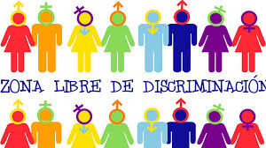

# Cuestion de género

**La sociedad permanentemente va cambiando y lo seguirá haciendo, lo cual supone derribar barreras construidas culturalmente y nos exige estar abiertos a nuevos paradigmas. 
Sin alusiones políticas a que cambiemos de acuerdo a tal o cual posicionamiento electoral, en esta ocasión nos introducimos sutilmente en una temática muchas veces inadvertida en el ambiente universitario incluso a riesgo que sea vista como políticamente incorrecta.**

### 1) Géneros
No vamos a hablar del sexo, sino del género con que una persona se siente identificada y con el cual se presenta ante la sociedad. Entre otras, una de las formas típicas para dar a conocer su género, es la vestimenta. 

*Por ejemplo:*
* Carlos es varón y está vestido con zapatillas azules, unos vaqueros nuevos, una remera con grandes dibujos.
* Mariana es una mujer que tiene puesto un vestido rojo, un pañuelo, lleva un collar con perlas y un par de aritos.
* Andy es una persona que se autopercibe de otro género y va vestida a su manera.

Sin ser exclusivas, hay prendas y accesorios que son socialmente aceptados como válidos para cada género. 
Evitando situaciones particulares como una despedida de soltero, un baile de disfraces o una movilización contra la violencia de género, un vestido o un zapato de tacos altos son parte del estereotipo femenino, pero no masculina. Prendas que sean sólo masculinas son menos, pero también las hay. Por otra parte, hay muchas prendas, como las remeras, que son aceptadas tanto para unos como otros sin despertar miradas prejuiciosas.
La moda cambia, los usos también, los géneros son cada vez más diversos. 

**Requerimiento:**
Ver si al detenernos sobre una persona, hay algo en ella que nos llame la atención por no ser lo esperado de su género o si por el contrario se amolda al estereotipo socialmente instituido. 

*Por ejemplo:*
Si le preguntamos a Carlos si está vestido de acuerdo a lo clásico de su género, la respuesta sería afirmativa.

### 2) Cambia, todo cambia
Una de las características de la sociedad es la posibilidad de que una persona cambie su género. Por ejemplo, nuestro amigo Carlos ahora adopta una condición de mujer. Cambia también su nombre y se hace llamar Carla. Luego, su vestimenta podrá cambiar o no.

**Requerimiento:**
Que una persona pueda cambiar su género y su nombre, y que lo anterior siga funcionando

*Por ejemplo: *
* Sin cambiarse de ropa, le volvemos a preguntamos a la persona llamada Carla si su vestimenta es clásica, la respuesta sigue siendo afirmativa. 
* En el caso que Mariana se haga varón, la respuesta sería diferente antes y después de un cambio de género, lo que no quita que luego quiera dejar el vestido y ponerse otra ropa masculina. 
* Andy cambia de genero y sigue llamándose igual.

### 3) Intereses en común
También nos interesa contemplar los intereses, gustos o actividades propias de cada persona, que si bien pueden también cambiar con los años, no depende de su género. 

*Por ejemplo:*
* Entre otras cosas, a Carlos le gusta ver películas y arreglar las plantas de su jardín, trabaja como telefonista en un call center y estudia sistemas en la Universidad. 
* A Mariana le gusta hacer asados, ver películas y también estudia sistemas en la Universidad
* A Andy le gusta hacer varias cosas.

**Requerimiento:**
Se quiere saber cuáles son las actividades en común entre dos personas. 

### 4) Búsqueda de pareja
Hay diferentes formas de armar pareja y las categorías de heterosexual u homosexual, si bien son las mas frecuentes, no llegan a cubrir la variedad de preferencias e intereses a la hora de elegir con quién compartir la vida. 
Además, son elecciones que también puede ir cambiando independientemente de su autopercepción. 

*Por ejemplo:*
Alguien que desde su nacimiento es varón, en su infancia sea tratado como tal y se espere de él una pareja de género femenino, puede que en un futuro decida seguir asumíendose masculino y busque tener como pareja a alguien de su mismo género. 

**Requerimiento:**
Lo que se quiere saber es, para una persona, quienes son los habitantes de una ciudad que podrían llegar a ser su pareja, considerando que la orientación sexual de ambos sea compatible y que tengan la mayoría de los intereses en común.

### 5) Pero hay costumbres que se mantienen
Hay algunas personas que aún adaptándose a la diversidad de orientaciones y prestando atención a la coincidencia de intereses, mantienen una regla tradicional en cuanto al perfil socio cultural: sólo arman pareja con personas de su misma clase social. 
La clase social de una persona se deduce por el costo de la vestimenta que lleva puesta y por lo tanto podría cambiar con el tiempo, lo que no cambia es la forma de pensar de quien creció y se educó de esta manera. 
A su vez, quien nació con un criterio más amplio, nunca asume esta forma tradicional de armar pareja.

**Requerimiento:**
Hacer los cambios necesarios para contemplar la nueva situación y que lo anterior siga funcionando

### Realizar:
* El código de la solución que hagan lo requerido
* Incluir al menos un test a elección de alguno de los puntos
* Una explicación sobre la aplicación de un concepto que haya sido importante para resolver el problema

